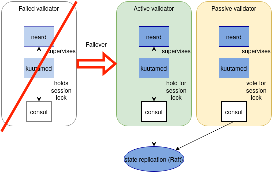

# Architecture

This page describes the minimal needed reference architecture for kuutamod to provide failover.
In later sections of this document we also describe variants and their tradeoffs.

From a 10,000 foot altitude the architecture of kuutamod looks like this:

Let's break this down. Kuutamod requires consul to elect the active validator by
acquiring a [session
lock](https://www.consul.io/docs/dynamic-app-config/sessions). The active
validator will receive the validator key of the pool. All other nodes running
kuutamod + neard become passive validator as depicted without validator key and
are kept in sync with the network for faster failover.

In case the active validator crashes or it becomes unavailable the session lock
is released and an passive node can become validator. Kuutamod itself also
constently performs healtchecks on neard and will initiate a failover itself in
case it detect failures.

## Required number of nodes

TL;DR You will need at least two nodes that run kuutamod + neard and three nodes
that run consul (consul can be colocated on the nodes that run kuutamod).
The nodes should be set up in a way that makes it unlikely for them to fail at
the same time (i.e. same power source, same network switch)

Explanation: Consul implements a consensus protocol called Raft to replicate
information about the current validator and also to detect network/node
failures. In order for Raft to work, an odd number of Consul servers are
required to avoid what is known as
[split-brain](<https://en.wikipedia.org/wiki/Split-brain_(computing)>) problem.
For example, if we only had two nodes, then if these two nodes could not reach
each other, it would be impossible for one node to determine whether the other
node had failed or only the intervening network was not working. In this case,
the system could end up allowing two active validators, which could result in
the validators beeing [kicked](https://nomicon.io/BlockchainLayer/EpochManager/Staking) or even lose
their stake in the future.

To counteract this, we recommend running at least three nodes for consul. Note
that the third instance can be run as an arbitor node, only with consul and
without kuutamod+neard. In this case, the hardware requirements for this node
could be reduced, with the disadvantage that one less possible failover instance
is available:

## Further readings

In our [failover article](failover-algorithm.md) we describe the algorithm used for failover.
