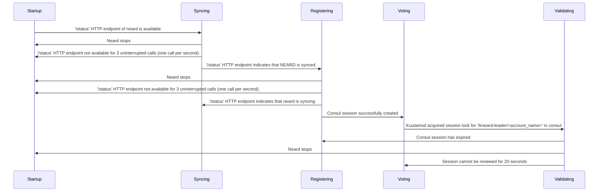

# Primary-Secondary failover design

This page describes the internal kneard state machine used
to manage neard and failover to instances in case a failure happens.

## States

When starting up, kneard will go through the series of states before it's
promoted as a validator. Here is an overview of all states:

1. Startup:

- Initial state
- Start neard and wait for `/status` api to become available

2. Syncing:

- Wait for client to catch up with the chain

3. Registering:

- Monitor that neard is still in sync with the chain
- Create a consul session

4. Voting:

- Monitor that neard is in sync with the chain
- Try to become leader of the validator key in consul,
  using the consul session from the previous state.

5. Validating:

- In this state, neard will be restarted with the validator key
- Only one validator instance should get into this state.

Kuutamod also exports the state it's currently in through its prometheus API:

```console
$ curl --silent http://localhost:2233/metrics | grep -E 'kuutamod_state'
# HELP kuutamod_state In what state our supervisor statemachine is
# TYPE kuutamod_state gauge
kuutamod_state{type="Registering"} 0
kuutamod_state{type="Shutdown"} 0
kuutamod_state{type="Startup"} 0
kuutamod_state{type="Syncing"} 0
kuutamod_state{type="Validating"} 1
kuutamod_state{type="Voting"} 0
```

In this case `kneard` is in `Validating` state.

## State transitions

In order to pass from one state to another, certain conditions must be
fulfilled. In the following we will go through all the possible transitions.



## Command

The command could change the state, each command will match current state and base on the result of execution to change a new state.
Currently, the command control socket only open in Voting and Validating states.

- `MaintenanceShutdown`: try to shutdown neard in maintenance window in Voting or Validating and not change the original state, after shutdown the neard will be restarted.
